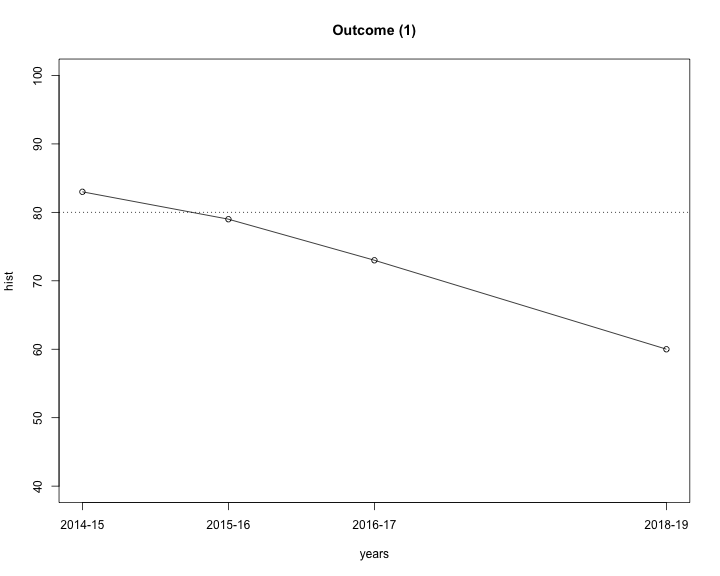
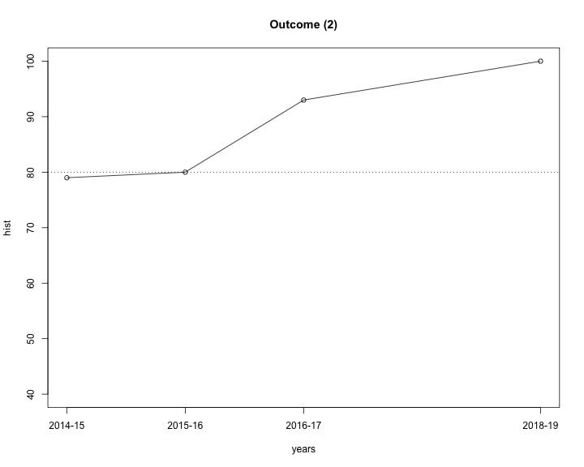
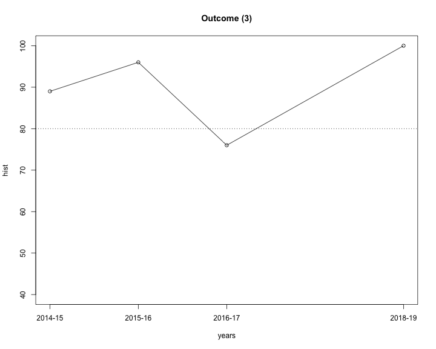
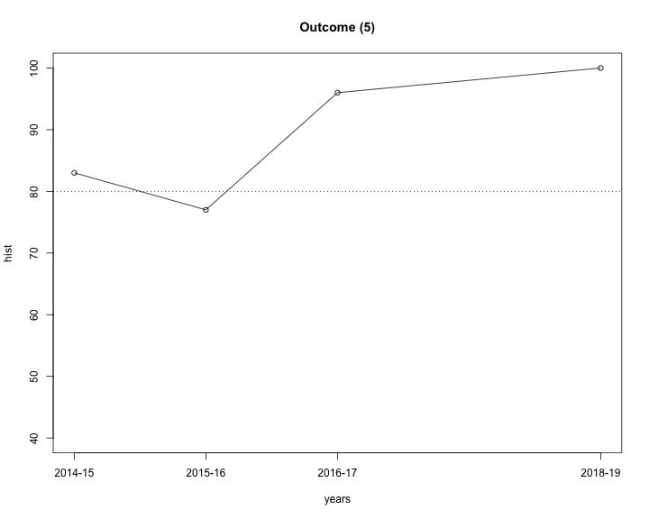
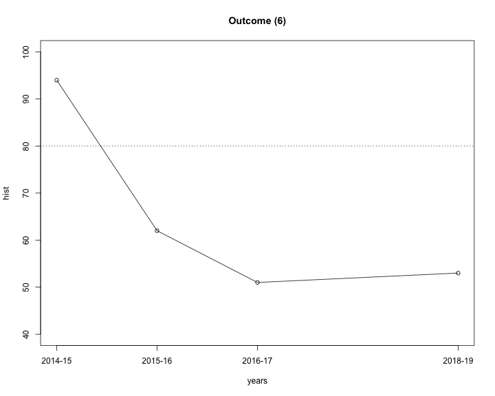

# ABET Assessment Results for AY 2016-17

## Summary

The data for AY 2016-17 was used as part of our continuing improvement process
in the Fall of 2017.

Outcome  | % Excelled | % Mastered | % Partially Mastered | % Below Expectations | #Student Assessments
:-------:|-----------:|-----------:|---------------------:|---------------------:|------------------------:
(a)      | 61 | 10 | 12 | 18 | 104
(b)      | 34 | 39 | 7 | 20 | 146
(c)      | 31 | 62 | 4 | 3 | 296
(d)      | 12 | 84 | 3 | 1 | 215
(e)      | 92 | 6 | 0 | 2 | 200
(f)      | 22 | 54 | 21 | 2 | 129
(g)      | NaN | NaN | NaN | NaN| 0
(h)      | NaN | NaN | NaN | NaN| 0
(i)      | 70 | 23 | 2 | 5| 43
(j)      | 34 | 17 | 31 | 18| 160
(k)      | NaN | NaN | NaN | NaN| 0

Considering Excelled and Mastered to "Satisfy" each student outcome, we can look at historical trends.

Outcome | %Satisfied 2014-15       | %Satisfied 2015-16       | %Satisfied 2016-17       | Last Year Change
:------:|-------------------------:|-------------------------:|-------------------------:|--------------------------------:
(a)     | 72 | 80 | 71 | -9
(b)     | 83 | 79 | 73 | -6
(c)     | 79 | 80 | 93 | 13
(d)     | 83 | 77 | 96 | 19
(e)     | 100 | 100 | 98 | -2
(f)     | 89 | 96 | 76 | -20
(g)     | 100 | 100 | NaN | NaN
(h)     | 100 | 91 | NaN | NaN
(i)     | 91 | 82 | 93 | 11
(j)     | 94 | 62 | 51 | -11
(k)     | 64 | 82 | NaN | NaN

TODO: As the table shows, the percentage of students who satisfy each outcome is mostly the same in
the two years for which we have data.  The outcomes (j) and (k) show the most difference, and
we attribute this to a better understanding of the assessment process among the faculty, as
opposed to any real change in student performance. We will, of course, continue to monitor
this closely in the next years.

The following graphs show the history of the outcomes (a) through (k).

More details of student assessment can be seen by considering the assessment of individual PKIs.

Outcome | KPI    | % Excelled | % Mastered | % Partially Mastered | % Below Expectations | #Student Assessments
:------:|:------:|-----------:|-----------:|---------------------:|---------------------:|--------------------:
(a)     | (a.1)  |  83 | 6 | 12 | 0 | 52
&nbsp;  | (a.2)  |  62 | 19 | 12 | 8 | 26
&nbsp;  | (a.3)  |  15 | 8 | 12 | 65 | 26
&nbsp;  | (a.4)  |  NaN | NaN | NaN | NaN | 0
&nbsp;  | (a.5)  |  NaN | NaN | NaN | NaN | 0
&nbsp;  | (a.6)  |  NaN | NaN | NaN | NaN | 0
(b)     | (b.1)  |  29 | 26 | 12 | 32 | 34
&nbsp;  | (b.2)  |  36 | 43 | 5 | 16 | 112
(c)     | (c.1)  |  0 | 100 | 0 | 0 | 46
&nbsp;  | (c.2)  |  0 | 100 | 0 | 0 | 46
&nbsp;  | (c.3)  |  40 | 50 | 4 | 6 | 121
&nbsp;  | (c.4)  |  58 | 19 | 16 | 7 | 43
&nbsp;  | (c.5)  |  45 | 55 | 0 | 0 | 40
(d)     | (d.1)  |  0 | 100 | 0 | 0 | 43
&nbsp;  | (d.2)  |  0 | 100 | 0 | 0 | 43
&nbsp;  | (d.3)  |  58 | 19 | 16 | 7 | 43
&nbsp;  | (d.4)  |  0 | 100 | 0 | 0 | 43
&nbsp;  | (d.5)  |  0 | 100 | 0 | 0 | 43
(e)     | (e.1)  |  90 | 8 | 0 | 2 | 50
&nbsp;  | (e.2)  |  90 | 8 | 0 | 2 | 50
&nbsp;  | (e.3)  |  90 | 8 | 0 | 2 | 50
&nbsp;  | (e.4)  |  98 | 2 | 0 | 0 | 50
(f)     | (f.1)  |  42 | 51 | 7 | 0 | 43
&nbsp;  | (f.2)  |  14 | 70 | 16 | 0 | 43
&nbsp;  | (f.3)  |  12 | 42 | 40 | 7 | 43
(g)     | (g.1)  |  NaN | NaN | NaN | NaN | 0
&nbsp;  | (g.2)  |  NaN | NaN | NaN | NaN | 0
(h)     | (h.1)  |  NaN | NaN | NaN | NaN | 0
&nbsp;  | (h.2)  |  NaN | NaN | NaN | NaN | 0
&nbsp;  | (h.3)  |  NaN | NaN | NaN | NaN | 0
(i)     | (i.1)  |  0 | 100 | 0 | 0 | 5
&nbsp;  | (i.2)  |  79 | 13 | 3 | 5 | 38
&nbsp;  | (i.3)  |  NaN | NaN | NaN | NaN | 0
&nbsp;  | (i.4)  |  NaN | NaN | NaN | NaN | 0
(j)     | (j.1)  |  15 | 0 | 54 | 31 | 26
&nbsp;  | (j.2)  |  39 | 24 | 36 | 0 | 33
&nbsp;  | (j.3)  |  71 | 24 | 0 | 6 | 34
&nbsp;  | (j.4)  |  9 | 6 | 61 | 24 | 33
&nbsp;  | (j.5)  |  29 | 26 | 12 | 32 | 34
(k)     | (k.1)  |  NaN | NaN | NaN | NaN | 0
&nbsp;  | (k.2)  |  NaN | NaN | NaN | NaN | 0
&nbsp;  | (k.3)  |  NaN | NaN | NaN | NaN | 0
&nbsp;  | (k.4)  |  NaN | NaN | NaN | NaN | 0

## Assessment Data

### COSC 1010: Intro to Programming, Allyson Anderson

Core Course                             | KPIs                        | Outcomes
:---------------------------------------|:----------------------------|:--------
COSC 1010: Intro to Programming         | (i.2)                       | (i)

    Performance Indicator (i.2): Program in Java, including use of the Java collections and other useful 
    Java frameworks

    Homework 8:  The salesReport project allows an employee to enter a simple daily sales report and prints out the results. The employee must enter his username and password. After verifying the username and password, the program allows the employee to enter his sales details for the day. Sales details include the product name, product ID#, price, and quantity sold. An object should be created for each product and then added to the daily collection of product objects. When the salesperson is finished entering data, the program calculates the total cash value of the salesperson's sales for the day and prints out the report. 

    38 students were assessed.
    30 excelled
    5 mastered
    1 partially mastered
    2 failed
 

### COSC 2030: Programming II, Tom Bailey

Core Course                             | Assessed
:---------------------------------------|:----------------------------
COSC 2030: Programming II               | Yearly

    Performance Indicator (i.1):  Program in C++, including use of the C++ Standard Library

---

    Performance Indicator (i.3):  Use an IDE to edit, compile, and debug a program

### COSC 2300: Discrete Structures, Ruben Gamboa

Core Course                             | Assessed
:---------------------------------------|:----------------------------
COSC 2300: Discrete Structures          | Yearly

    Performance Indicator (a.1): Use discrete mathematics techniques
 
     Final Question 1: 
        Propositional reasoning
 
     26 students were assessed.
 
     23 students excelled.
      0 students mastered.
      3 students partially mastered.
      0 student was below expectations.

     Final Question 2: 
        Predicate reasoning
 
     26 students were assessed.
 
     20 students excelled.
      3 students mastered.
      3 students partially mastered.
      0 student was below expectations.

---

    Performance Indicator (a.2): Estimate cardinality of relevant events
                                 in computing applications
 
     Final Question 9
       counting and discrete probability
 
     26 students were assessed.
 
     16 students excelled.
      5 students mastered.
      3 students partially mastered.
      2 students were below expectations.

---

    Performance Indicator (a.3): Use mathematical induction to prove 
                                 mathematical formulas that arise
                                 in computing applications
 
     Final Question 7 
       structural induction
 
     24 students were assessed.
 
      4 students excelled.
      2 student mastered.
      3 students partially mastered.
     17 student was below expectations.
     
     Note: This PKI is being assessed differently than in previous years. We used to assess using mathematical 
     induction, but now we are assessing structural induction in the context of a functional program, which is 
     considerably more difficult. The results are significantly down this year, but we expect that to come back 
     up in future years.

### COSC 3011: Software Design, Kim Buckner

Core Course                             | Assessed
:---------------------------------------|:----------------------------
COSC 3011: Software Design              | Yearly

    Performance Indicator (b.2): Analyze at least two or more proposed solutions 
    to given problem and select the best solution for the given problem.

    This was assessed through the program design project. The teams were required to plan, design, and program a game. This was in five steps over the majority of the semester with the sixth, wrap-up due as the final.
    I have combined the results of the first five steps of the programming project as I did for the course grade.

    68 students were assessed.

    Excelled: 30 students 
    Mastered: 39 students 
    Partially Mastered: 2 students 
    Below Expectations: 7

---

    Performance Indicator (c.3): Design the selected solution for a given problem. 

    This was assessed through the program design project. The teams were required to plan, design, and program a game. This was in five steps over the majority of the semester with the sixth, wrap-up due as the final.
    I have combined the results of the first five steps of the programming project as I did for the course grade.

    68 students were assessed.

    Excelled: 30 students 
    Mastered: 39 students 
    Partially Mastered: 2 students 
    Below Expectations: 7

---

    Performance Indicator (k.2): Describe commonly used design patterns.

---

    Performance Indicator (k.3): Design the selected solution for a given problem. 

### COSC 3020: Algorithms & Data Structures, Lars Kotthoff

Core Course                             | Assessed
:---------------------------------------|:----------------------------
COSC 3020: Algorithms & Data Structures | Every other year, starting 2016-17

---

    Performance Indicator (a.4): Calculate the sum of arithmetic series 
                                 that arise in computing applications
 

---

    Performance Indicator (a.5): Calculate the sum of geometric series 
                                 that arise in computing applications
 

---

    Performance Indicator (a.6) :  Use calculus to find the asymptotic limit of functions

---

    Performance Indicator (b.1) :  Identify key components and algorithms necessary for a solution

    Assignment 3: Implement two algorithms for solving the traveling salesman 
    problem and compare them. 

    34 students assessed. 

    10 students excelled. 
    9 students mastered. 
    4 students partially mastered. 
    11 students were below expectations. 

---

    Performance Indicator (b.2) :  Analyze at two or more proposed solutions to a given problem and select the best solution for the given problem 

    Assignment 3: Implement two algorithms for solving the traveling salesman 
    problem and compare them. 

    34 students assessed. 

    10 students excelled. 
    9 students mastered. 
    4 students partially mastered. 
    11 students were below expectations. 

---
    Performance Indicator (j.1) :  Analyze the asymptotic cost of divide-and-conquer algorithms

    Question 3 in assignment 2: Implement an iterative and in-place version of merge 
    sort and analyze its complexity. 

    31 students assessed. 

    4 students excelled. 
    5 students mastered. 
    14 students partially mastered. 
    8 students were below expectations. 

---

    Performance Indicator (j.2) :  Analyze the asymptotic cost of recursive algorithms

    Question 3 in the midterm: Give Theta-bounds for three recurrence 
    relations. 

    33 students assessed. 

    13 students excelled. 
    8 students mastered. 
    12 students partially mastered. 
    0 students were below expectations. 

---

    Performance Indicator (j.3): Analyze the asymptotic cost of basic graph algorithms

    Lab 7: Implement the Floyd-Warshall algorithm and analyze its complexity. 

    34 students assessed. 

    24 students excelled. 
    8 students mastered. 
    2 students were below expectations. 

---

    Performance Indicator (j.4):  Describe the impact of techniques such as caching 
    and dynamic programming on the performance of algorithms

    Question 5 in final: Implement a dynamic programming solution to 
    compute the Liouville number. 

    33 students assessed. 

    3 students excelled. 
    2 students mastered. 
    20 students partially mastered. 
    8 students were below expectations. 

---

    Performance Indicator (j.5):  Understand the difference between polynomial 
    and exponential complexity

    Assignment 3: Implement two algorithms for solving the traveling salesman 
    problem (one complete, exponential complexity, one approximate, polynomial 
    complexity) and compare them. 

    34 students assessed. 

    10 students excelled. 
    9 students mastered. 
    4 students partially mastered. 
    11 students were below expectations. 

### COSC 3050: Ethics, Kim Buckner

Core Course                             | Assessed
:---------------------------------------|:----------------------------
COSC 3050: Ethics                       | Every other year, starting 2016-17

    Performance Indicator (e.1): Recognize ethical issues involved in a 
    professional setting.

    As such I will provide documents relating to the individual topics but only one assessment for student performance for the entire course. There were 24 students assessed. 
    The assessment consisted of the following.

    Reading their quiz answers and giving full credit if they had an answer at all and that answer was for the question asked. This was the portion that to a large extent caused the students to read the provided material.

    There were 50 students assessed for the two sections of the course.

    Excelled: 45 students 
    Mastered: 4
    Partially Mastered: 0 
    Below Expectations: 1

---

    Performance Indicator (e.2): Describe current issues in security. 

    As such I will provide documents relating to the individual topics but only one assessment for student performance for the entire course. There were 24 students assessed. 
    The assessment consisted of the following.

    Reading their quiz answers and giving full credit if they had an answer at all and that answer was for the question asked. This was the portion that to a large extent caused the students to read the provided material.

    There were 50 students assessed for the two sections of the course.

    Excelled: 45 students 
    Mastered: 4
    Partially Mastered: 0 
    Below Expectations: 1

---

    Performance Indicator (e.3): Describe current issues in privacy.

    As such I will provide documents relating to the individual topics but only one assessment for student performance for the entire course. There were 24 students assessed. 
    The assessment consisted of the following.

    Reading their quiz answers and giving full credit if they had an answer at all and that answer was for the question asked. This was the portion that to a large extent caused the students to read the provided material.

    There were 50 students assessed for the two sections of the course.

    Excelled: 45 students 
    Mastered: 4
    Partially Mastered: 0 
    Below Expectations: 1

---

    Performance Indicator (e.4): Respect and honor ethics in writing assignments.

    Their final papers were all reasonable, the biggest problems being grammatical errors es- pecially for our foreign students.

    There were 50 students assessed for the two sections of the course.

    Excelled: 49 students 
    Mastered: 4
    Partially Mastered: 0 
    Below Expectations: 1

---

    Performance Indicator (g.1): Understand the impact of computing solutions on 
    society in a global economic context.
    
---

    Performance Indicator (g.2): Describe non-technical computing issues such as 
    sustainability, entrepreneurship, and outsourcing.

---

    Performance Indicator (h.1): Read and report on papers in the technical literature.

---

    Performance Indicator (h.3): Review articles, chapters, or presentations from the 
    professional literature.
    
